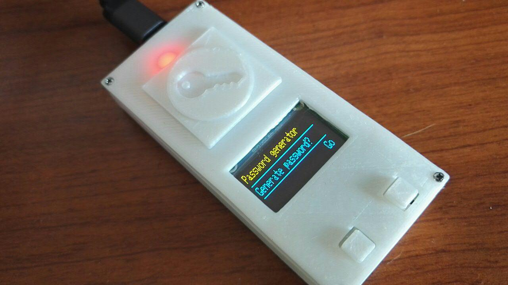

# Arduino Random Password Generator
An hardware for random password generation that uses human inputs to generate a seed and can copy the generated password as keyboard. 

It has been made using an [Arduino Pro Micro](https://www.sparkfun.com/tutorials/337), that can actually emulate a Keyboard. 

Unfortunately all the (functioning) interrupts were occupied by the display, so I had to be a little bit creative with the code. 

## Features
* Seed generation and improvement. The seed is an unsigned long int, and it is modified using addition and/or multiplicationaccording to how many times and for how long a button is pressed. 
* Alphanumeric password or with symbols. Passwords are 256 character long.
* Password copy to any compatible device. After it has been generated, the password can be copied to any computer that supports HID keyboard. 

## To do
* Asymmetric authentication to check if the device has been messed with. Requires an HTTPS web server or a trusted desktop application.

## Pictures

